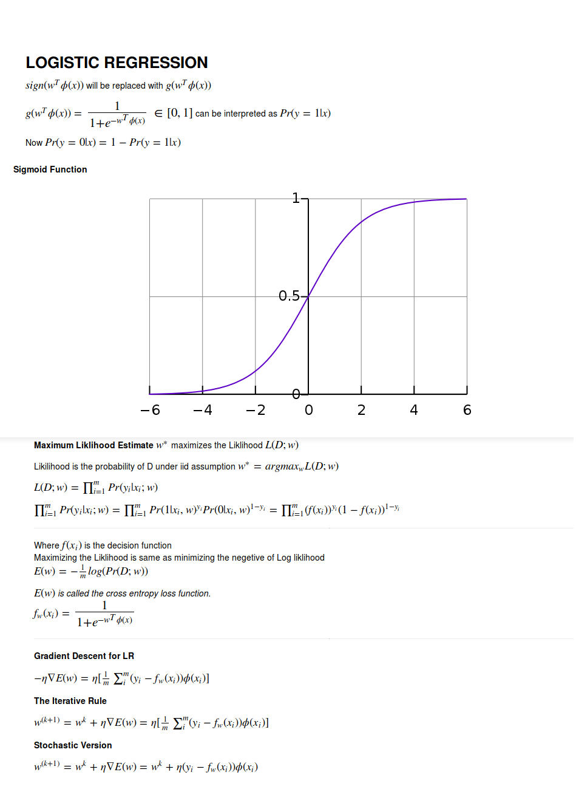
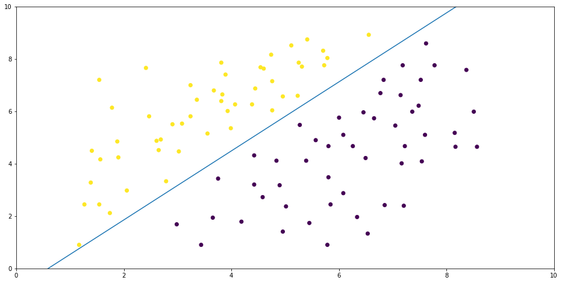
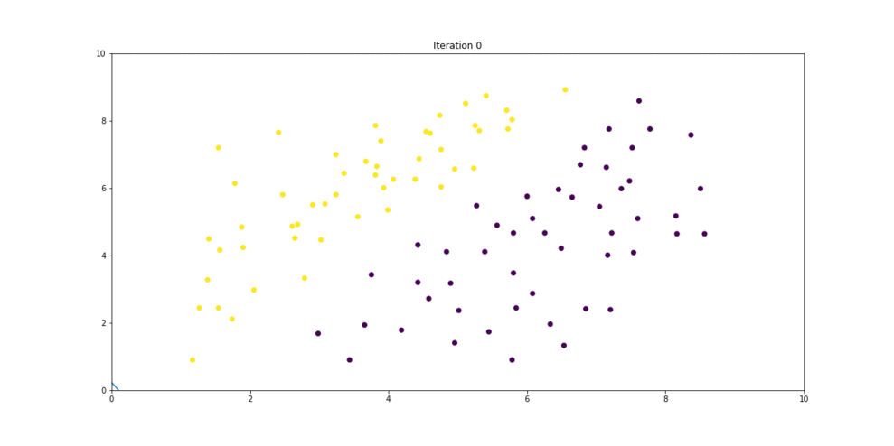

```python
import pandas as pd
import numpy as np
import matplotlib.pyplot as plt

%pylab inline
pylab.rcParams['figure.figsize'] = (16, 8)

data=pd.read_csv('dataset/data.csv')
data.head()

X=data[['x','y']]
def zero_one(x):
    if x==1:
        return 1
    else:
        return 0
Y=data['label'].apply(zero_one)
```

    Populating the interactive namespace from numpy and matplotlib


```python
class logistic_regression():
    def __init__(self,mode='batch',lr=0.01,max_step=12):
        self._mode=mode
        self._lr=lr
        self._max_step=max_step
        self._phi=None
        self._w=None
        self._y=None

    #augment phi
    def augment(self,x):
        x=np.hstack((x,np.ones(len(x)).reshape((len(x),1))))
        return x

    #sigmoid fns
    def sigmoid_fns(self,x):
        return 1./(1.+np.exp(-np.dot(self._w.T,x)))

    #fit
    def fit(self,X,Y):
        self._phi=self.augment(X.as_matrix())
        self._y=Y
        self._w=np.ones(self._phi.shape[1])
        self.sgd()

    #stochastic gradient descent
    def sgd(self):
        for i in range(self._max_step):
            for j in range(len(self._phi)):
                self._w+=self._lr*(self._y[j]-self.sigmoid_fns(self._phi[j]))*self._phi[j]
        print("<<DONE TRAINING>>")

    #predict
    def predict(self,x):
        x=self.augment(x.as_matrix())
        res=np.dot(x,self._w)
        res=np.exp(-res)
        res=(1./(1.+res))
        def label(x):
            if x>=0.5:
                return 1
            else:
                return 0
        f=np.vectorize(label)
        return f(res)

    #boundary function in 2D
    def boundary2D(self,x):
        c=-self._w[2]/self._w[1]
        m=-self._w[0]/self._w[1]
        return m*x+c

    #plot decision boundary in 2D
    def plot(self):
        x=np.linspace(0,10)
        plt.scatter(self._phi[:,0],self._phi[:,1],c=self._y)
        plt.plot(x,self.boundary2D(x))
        plt.xlim(0,10)
        plt.ylim(0,10)
        plt.show()


```


```python
p=logistic_regression(max_step=20,lr=0.8)
#Fit model with Data
p.fit(X,Y)
#plot decison boundary
p.plot()


```

    <<DONE TRAINING>>





## Logistic Regression Fit


