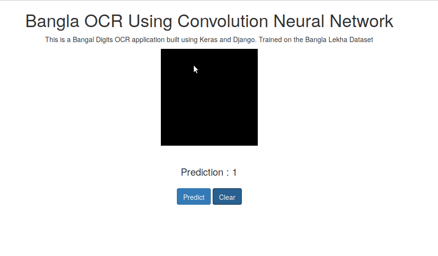

# Bangla Digit OCR using Convolutional Neural Networks

This was done using a simple CNN built using Keras and the web app built with django , the CNN was trained on the Bangla Lekha Dataset . 

  
</img>
