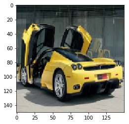

```python
from keras.preprocessing.image import ImageDataGenerator
from keras.models import Sequential
from keras.layers import Conv2D, MaxPooling2D
from keras.layers import Activation, Dropout, Flatten, Dense

model = Sequential()
model.add(Conv2D(32, (3, 3), input_shape=(150,150,3)))
model.add(Activation('relu'))
model.add(MaxPooling2D(pool_size=(2, 2)))

model.add(Conv2D(32, (3, 3)))
model.add(Activation('relu'))
model.add(MaxPooling2D(pool_size=(2, 2)))

model.add(Conv2D(64, (3, 3)))
model.add(Activation('relu'))
model.add(MaxPooling2D(pool_size=(2, 2)))

model.add(Flatten())  
model.add(Dense(64))
model.add(Activation('relu'))
model.add(Dropout(0.5))
model.add(Dense(3))
model.add(Activation('sigmoid'))

model.compile(loss='categorical_crossentropy',
              optimizer='adam',
              metrics=['accuracy'])
```

    Using TensorFlow backend.


```python
batch_size = 16

train_datagen = ImageDataGenerator(
        rescale=1./255,
        shear_range=0.2,
        zoom_range=0.2,
        horizontal_flip=True)

test_datagen = ImageDataGenerator(rescale=1./255)

train_generator = train_datagen.flow_from_directory(
        'data/train',
        target_size=(150, 150),
        batch_size=batch_size,
        class_mode='categorical')

validation_generator = test_datagen.flow_from_directory(
        'data/validation',
        target_size=(150, 150),
        batch_size=batch_size,
        class_mode='categorical')
```

    Found 1050 images belonging to 3 classes.
    Found 104 images belonging to 3 classes.


```python
nb_train_samples =1050
nb_validation_samples = 104
model.fit_generator(
        train_generator,
        steps_per_epoch=nb_train_samples // batch_size,
        epochs=10,
        validation_data=validation_generator,
        validation_steps=nb_validation_samples // batch_size)
model.save_weights('im_clf.h5')  
```

    Epoch 1/10
    65/65 [==============================] - 53s - loss: 0.1747 - acc: 0.9375 - val_loss: 1.2971 - val_acc: 0.8068
    Epoch 2/10
    65/65 [==============================] - 54s - loss: 0.1537 - acc: 0.9490 - val_loss: 1.1555 - val_acc: 0.7386
    Epoch 3/10
    65/65 [==============================] - 54s - loss: 0.1491 - acc: 0.9490 - val_loss: 1.2757 - val_acc: 0.7500
    Epoch 4/10
    65/65 [==============================] - 55s - loss: 0.1216 - acc: 0.9514 - val_loss: 1.2109 - val_acc: 0.7614
    Epoch 5/10
    65/65 [==============================] - 56s - loss: 0.1240 - acc: 0.9538 - val_loss: 1.4149 - val_acc: 0.7500
    Epoch 6/10
    65/65 [==============================] - 57s - loss: 0.1356 - acc: 0.9471 - val_loss: 1.5083 - val_acc: 0.7614
    Epoch 7/10
    65/65 [==============================] - 55s - loss: 0.1269 - acc: 0.9523 - val_loss: 1.3432 - val_acc: 0.7708
    Epoch 8/10
    65/65 [==============================] - 55s - loss: 0.1867 - acc: 0.9192 - val_loss: 0.9539 - val_acc: 0.7614
    Epoch 9/10
    65/65 [==============================] - 55s - loss: 0.1562 - acc: 0.9365 - val_loss: 1.3533 - val_acc: 0.7500
    Epoch 10/10
    65/65 [==============================] - 55s - loss: 0.1462 - acc: 0.9475 - val_loss: 1.3966 - val_acc: 0.7955


```python
# from keras.preprocessing.image import array_to_img, img_to_array, load_img
# img=load_img('data/test/im1.jpg',target_size=(150,150))
# x = img_to_array(img)  
# x = x.reshape((1,) + x.shape)  
%matplotlib inline

labels=["Airplane","Car","Motorbike"]
import cv2
import numpy as np
import matplotlib.pyplot as plt

img=cv2.imread('data/test/im.jpg') # loading image 
img=cv2.cvtColor(img,cv2.COLOR_BGR2RGB)
img=cv2.resize(img,(150,150)) # resizing 
plt.imshow(img)
img=np.divide(img,255.) #rescaling 
preds=np.around(model.predict(np.array([img])),3)
print
for i in xrange(len(preds[0])):
    print labels[i],'-> ',preds[0][i]


print labels[int(model.predict_classes(np.array([img])))]
   
```

    
    Airplane ->  0.0
    Car ->  0.551
    Motorbike ->  0.003
    1/1 [==============================] - 0s
    Car




