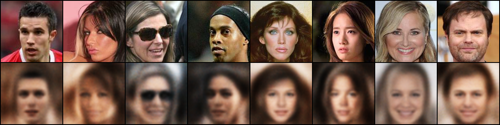
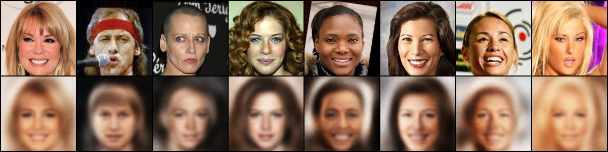
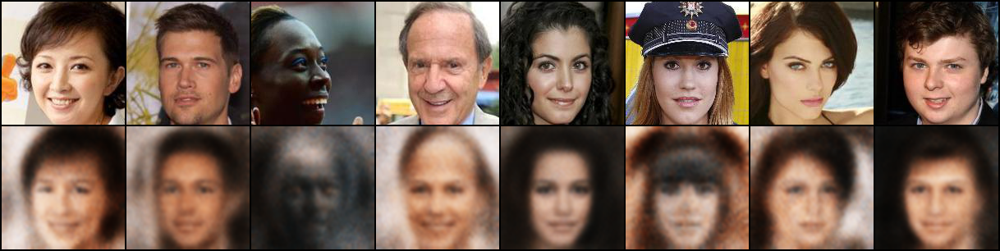
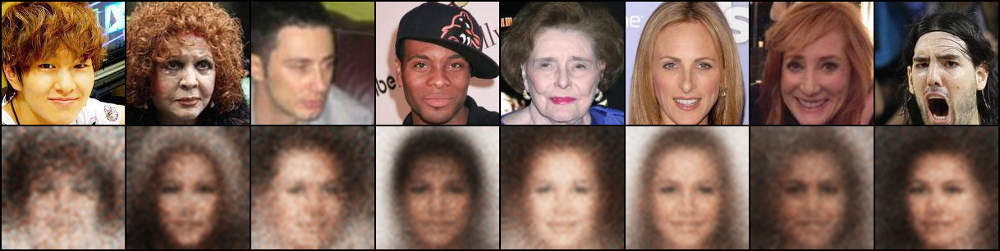
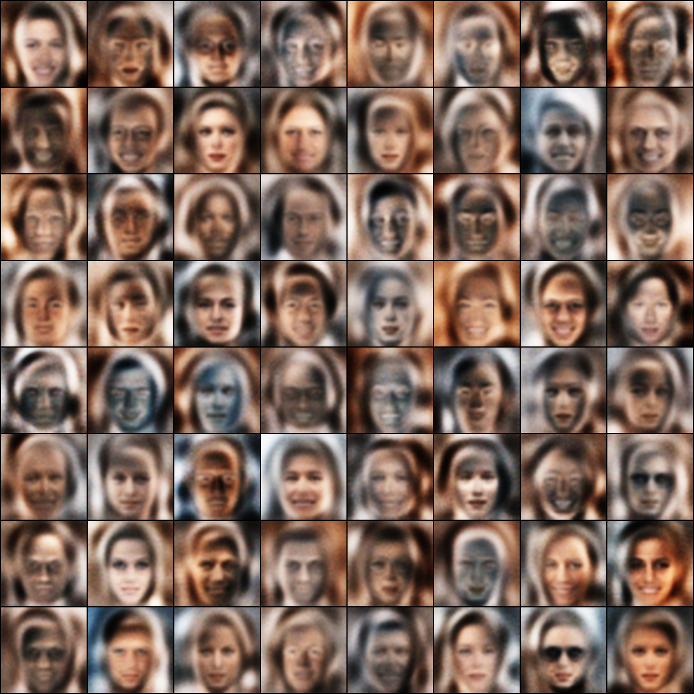
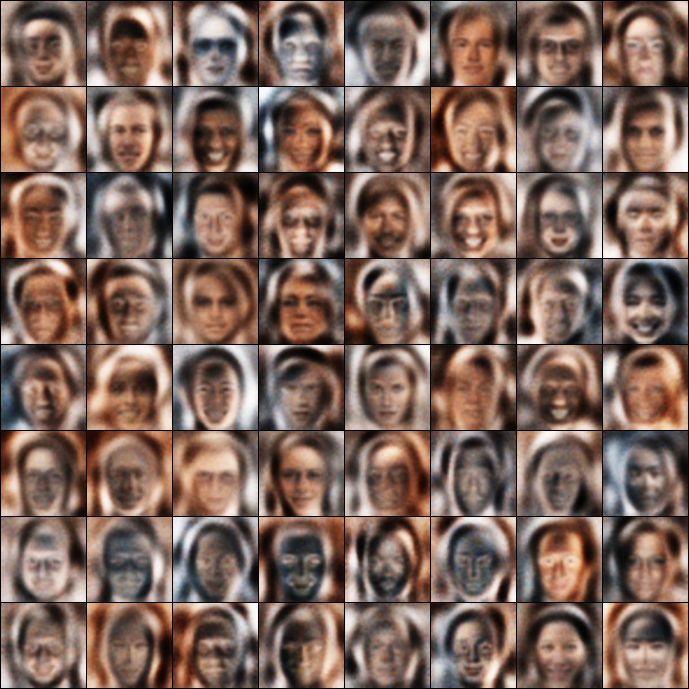
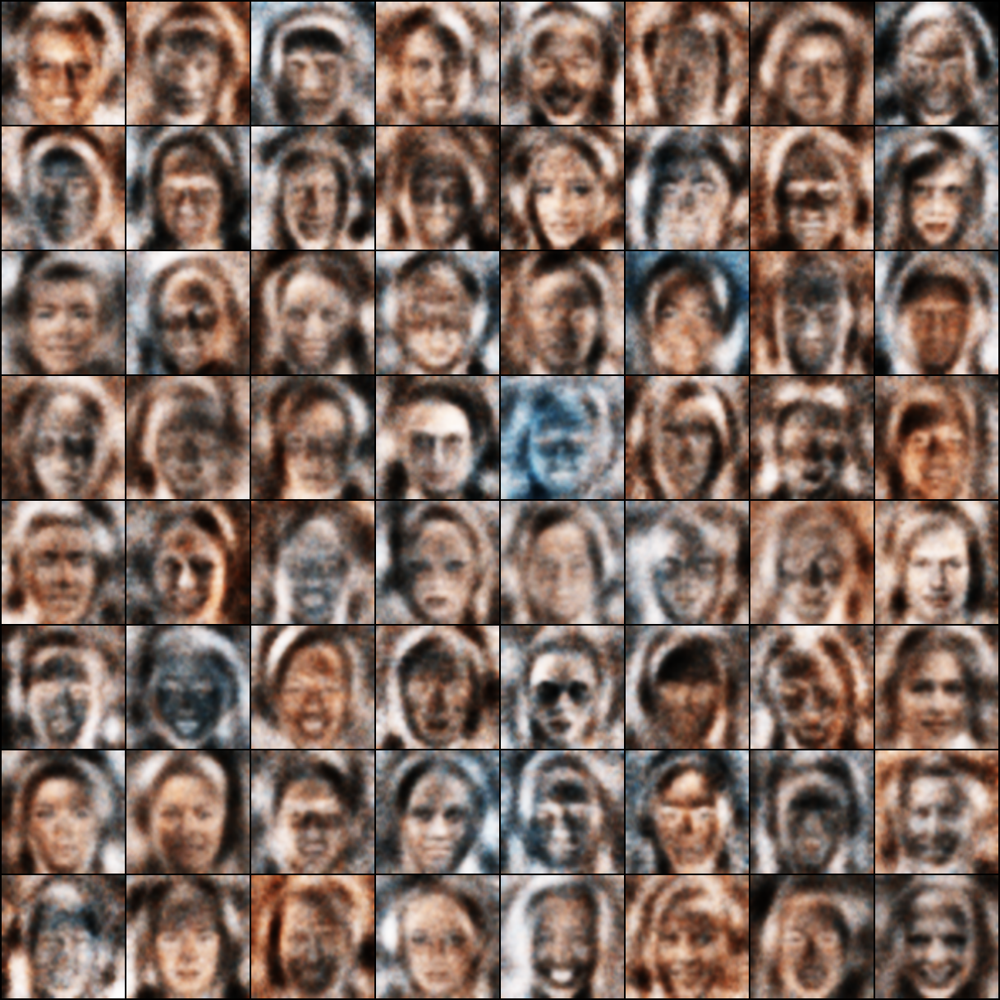
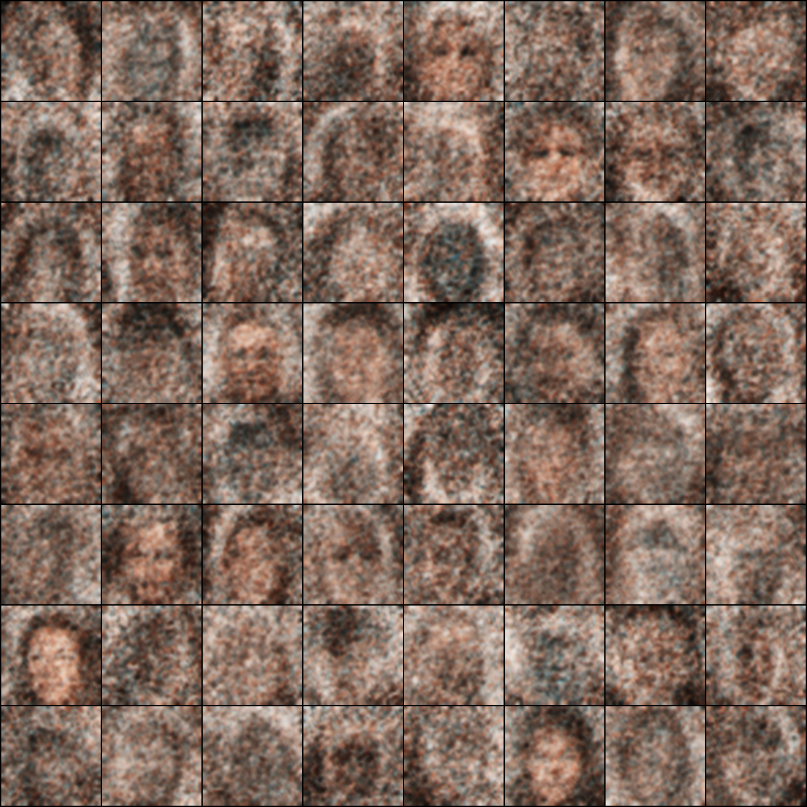

<h1> Variational Auto Encoders </h1>

<h2> AutoEncoders </h2>

Autoencoders are special type of encoder decoder neural network where on one side you feed your data and on the other side you want to reconstruct the same data , in the middle you try to compress the data to a vector **z** where **len(z) << len(data)** . A typical autoencoder looks like this 

This autoencoders are good for compression of data , but not in the case when we cant to generate new data from our training images or generate data which are completely new and never seen in the training examples , but somewhere related to our training images.

More formally we can define it as we want to build a generative model , which on trained on samples can learn and produce new samples which are from the training samples distribution, so our goal is to not only learn a netowork which can compress the training images and reconstruct it back but also which can learn the distribution which the training samples follow.

<h2> Variational Autoencoders </h2>

So in a variational autoencoder our task to is find out the distribution of our training samples and furthur produce samples from that distribution.

Here we need to minimize two losses , One the **log liklihood loss** and the other is the **KL Divergence** , The first will ensure that we are able to reconstruct our training samples and the second ensures that we can find out the distribution of the training sample.

Here we use a CNN as an Encoder with layers and relu as activation and in Decoder we use Billinear Upsample. All the images are resized to 150x150.

# Results

## Reconstructions

#### Epoch 28

#### Epoch 20

#### Epoch 10

#### Epoch 2

## Generations

#### Epoch 28

#### Epoch 20

#### Epoch 10

#### Epoch 2

## Generation Epoch 1 to Epoch 28

